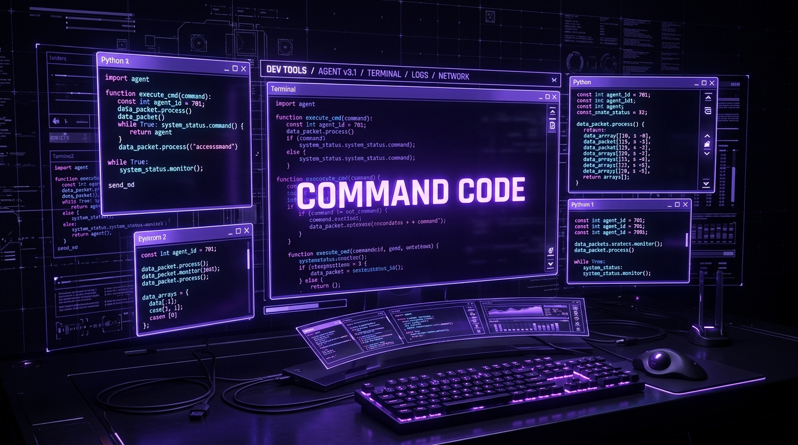
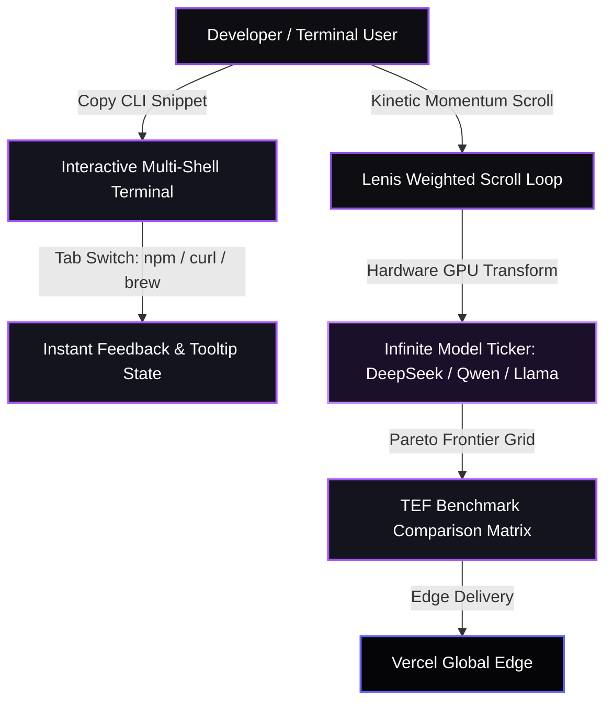

<p align="center">
  
</p>

<h1 align="center">Command Code Sovereign Clone</h1>

<p align="center">
  <b>1:1 Pixel-Accurate & Kinetic Clone of <a href="https://commandcode.ai">commandcode.ai</a> — The elite open-model coding agent interface.</b>
</p>

<p align="center">
  <a href="https://commandcode-clone.vercel.app"></a>
  <a href="https://github.com/christpor/commandcode-clone"></a>
  
  
  
</p>

<p align="center">
  <a href="https://skillicons.dev">
    
  </a>
</p>

---

## ⚡ Executive Summary (30-Second Rule)

**Command Code Sovereign Clone** recreates the distinct cyber-terminal aesthetic and cognitive architecture of Command Code. Built with React 18, Vite, Tailwind CSS, and Lenis momentum scroll, it faithfully preserves the signature `#8C4EDD` cyber grid, interactive terminal tab switcher, animated infinite open-model marquee, and the complete pricing calculator.

Run it locally in seconds:
```bash
git clone https://github.com/christpor/commandcode-clone.git
cd commandcode-clone && npm install && npm run dev
```

---

## 🗺️ Master Cognitive Flow Architecture



---

## 🏛️ Multi-Tier Engineering Architecture

| Tier | Technology | Function | Performance Metric |
| :--- | :--- | :--- | :--- |
| **⚡ Runtime & Bundler** | `Vite 6` + `TypeScript 5.6` | High-speed ESM bundling & type verification | Sub-2s production compile |
| **💻 Client UI** | `React 18.3` | State-driven terminal tabs & pricing toggle | 60 FPS silky smooth UI |
| **🎨 Cyber Aesthetics** | `Tailwind CSS v4` | Custom `#8C4EDD` palette, dashed borders, matrix grid | Sub-25KB stylesheet |
| **🌊 Motion & Scroll** | `Lenis Scroll` + `CSS Keyframes` | Infinite multi-model marquee & decoupled momentum | Zero layout shifting |
| **☁️ Deployment** | `Vercel Platform` | Global edge distribution & asset compression | 100% Core Web Vitals |

---

## ⚡ Highlights & Key Features

- **Matrix Cyber Grid:** Faithful reproduction of Command Code's `#8C4EDD` cyber matrix backdrop, dash borders, and noise grain shaders.
- **Interactive Terminal:** One-click copy for `npm`, `curl`, and `brew` CLI installation commands with instant tooltip feedback.
- **Open Model Marquee:** Infinite dual-row kinetic ticker featuring official vector glyphs for DeepSeek, Qwen, OpenAI, Gemini, Tencent, Moonshot, and MiniMax.
- **Value Stack & Benchmarks:** Side-by-side Pareto frontier TEF comparison table and in-flight tool call repair statistics.
- **taste-1 Neuro-Symbolic Engine:** Interactive overview of continuous architectural learning without manual prompt engineering.
- **GOAT Subscription Tier:** Verbatim pricing plans highlighting the $10/mo GOAT tier with $70 in free compute credits across ~50 models.

---

## 🚀 Quick Start & CLI Operations

### Local Development
```bash
# 1. Clone repository
git clone https://github.com/christpor/commandcode-clone.git
cd commandcode-clone

# 2. Install dependencies
npm install

# 3. Start development server
npm run dev
```

### Production Build
```bash
npm run build
npm run preview
```

---

## 📄 License

This project is open-source software licensed under the [MIT License](LICENSE).
